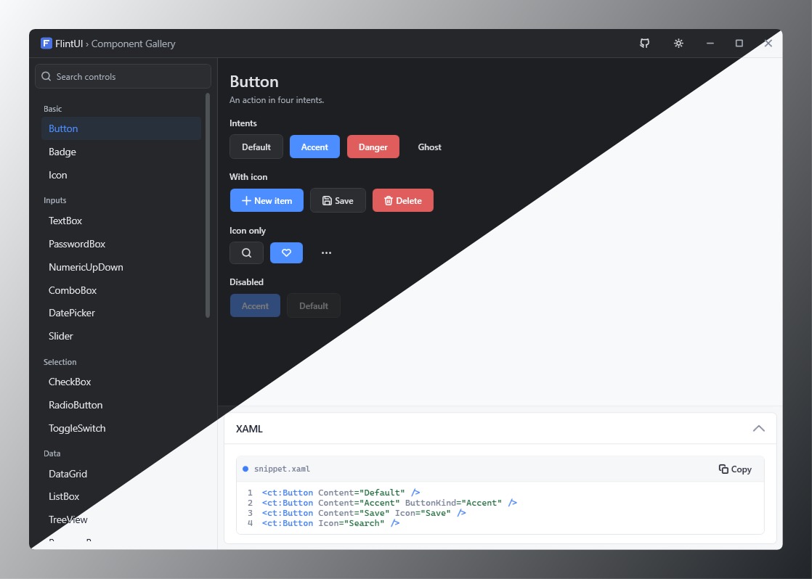
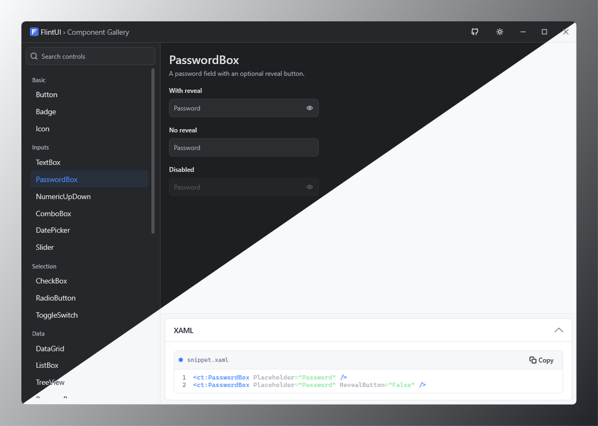
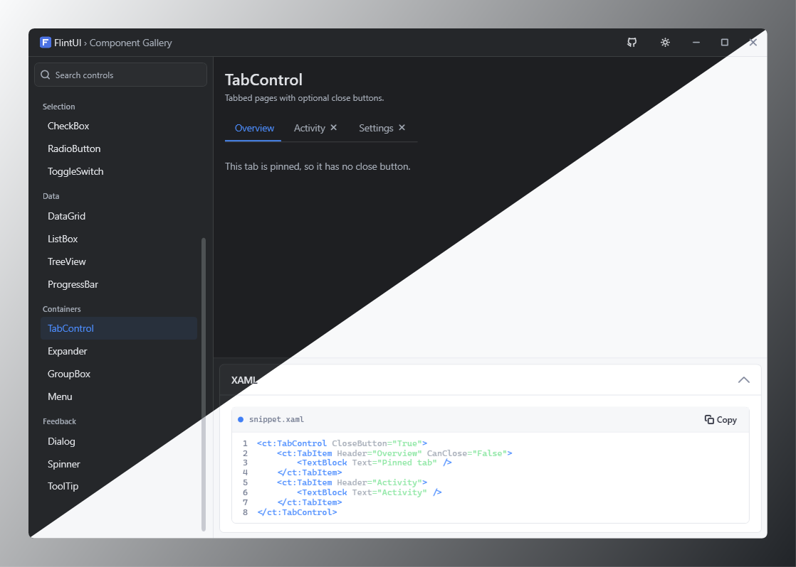

[](https://dotnet.microsoft.com/)
[](https://github.com/Rckov/FlintUI/actions/workflows/release.yml)
[](https://www.nuget.org/packages/FlintUI)


# FlintUI

A WPF control library.

## Getting started

```
dotnet add package FlintUI
```

Merge `FlintResources` into `App.xaml` and pick a theme:

```xml
<Application xmlns:ui="clr-namespace:FlintUI;assembly=FlintUI" ...>
    <Application.Resources>
        <ResourceDictionary>
            <ResourceDictionary.MergedDictionaries>
                <ui:FlintResources Theme="Light" />
            </ResourceDictionary.MergedDictionaries>
        </ResourceDictionary>
    </Application.Resources>
</Application>
```

## Demo

A gallery of every control. Grab the build from
[Releases](https://github.com/Rckov/FlintUI/releases/latest), or run it from source with
`dotnet run --project examples`.

## Screenshots







---

[MIT License](LICENSE) · [Report an Issue](https://github.com/Rckov/FlintUI/issues)